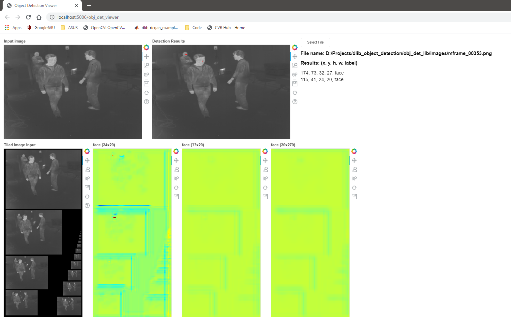

# Object Detection Viewer

This is a python project that links to the [dynamic library](https://github.com/davemers0160/dlib_object_detection/tree/master/obj_det_lib) project.  This code invokes a bokeh server to display the results of running the detector on an image in a web browser.

## Dependencies

1. The requirements listing in requirements.txt
2. [Object Detector Library](https://github.com/davemers0160/dlib_object_detection/tree/master/obj_det_lib)

## Code Modifications

This code links to the Object Detector Library, so the paths must be modified to point to the correct locations.  In the python code ind the following section of code and change the *lib_location* and *weights_file* variables to point to the correct locations for each.

```
if platform.system() == "Windows":
    libname = "obj_det.dll"
    lib_location = "D:/Projects/dlib_object_detection/obj_det_lib/build/Release/" + libname
    weights_file = "D:/Projects/dlib_object_detection/obj_det_lib/nets/fd_v10a_HPC_final_net.dat"
elif platform.system() == "Linux":
    libname = "libobj_det.so"
    home = os.path.expanduser('~')
    lib_location = home + "/Projects/dlib_object_detection/obj_det_lib/build/" + libname
    weights_file = home + "/Projects/dlib_object_detection/obj_det_lib/nets/fd_v10a_HPC_final_net.dat"
else:
    quit()

```

## Running

To run the code open up a command/terminal window in this project folder and run the following command:

```
bokeh serve --show src/obj_det_viewer.py
```

The code will ask you to select a file.  For the network and weights file navigate to this folder:

```
../obj_det_lib/images
```

and select one of the images.  You should see the following output.


